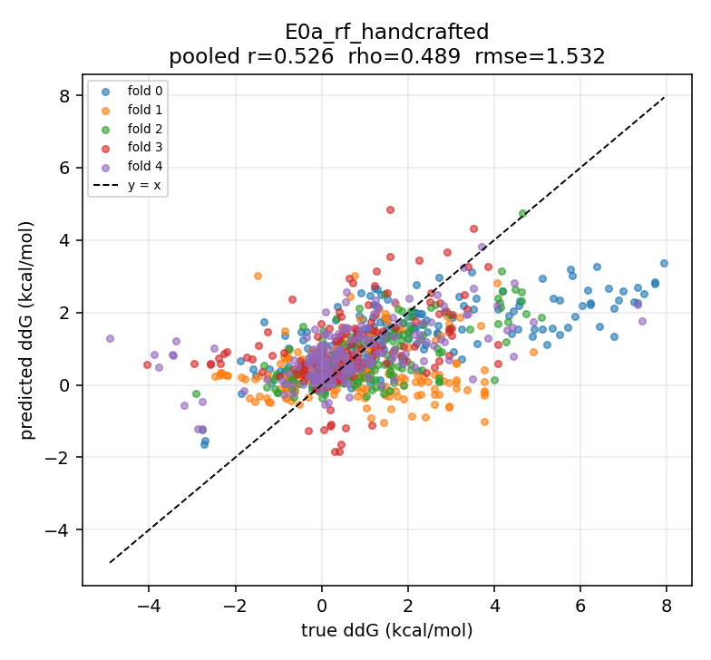
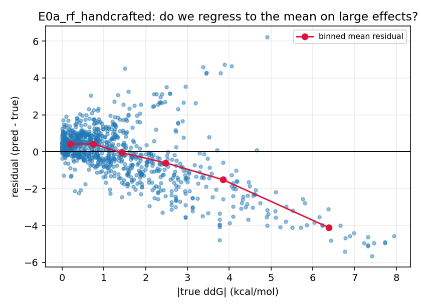
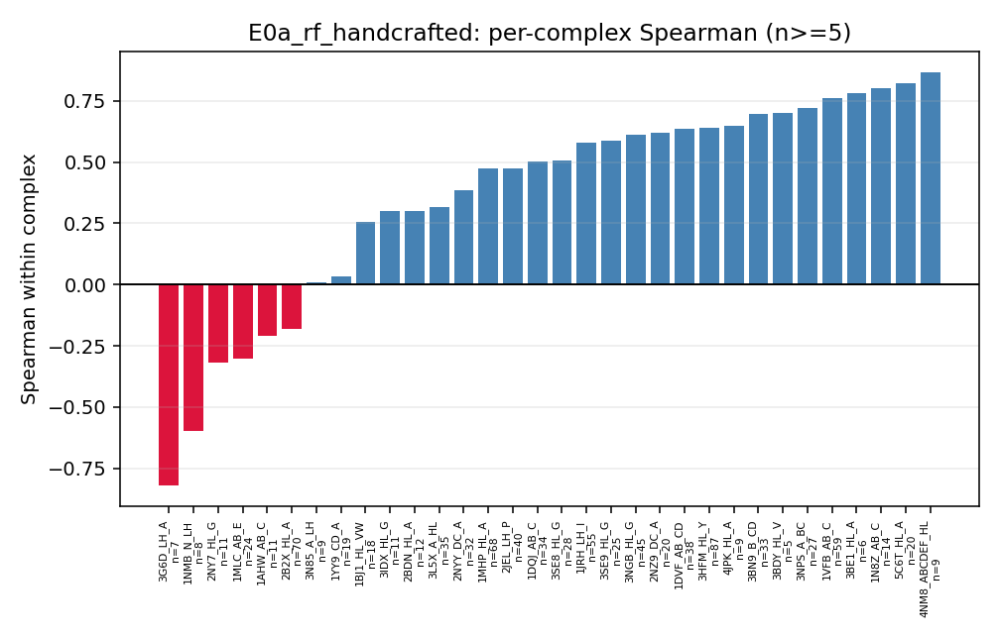

# Error analysis — E0a_rf_handcrafted (seed 0)

Out-of-fold predictions on the frozen 5-fold by-complex split
(`data/splits/skempi_abag_5fold_by_complex.json`).

Read every slice against its own `sd_true`: **`rmse_over_sd` >= 1 means the model adds
nothing within that slice**, whatever its RMSE looks like next to other slices. And
check `top_cx_share` before believing a slice — at 0.6 the slice result is one
complex's result wearing a category label.

## Overall

| n | complexes | pearson | spearman | rmse | mae | acc3 | f1_macro3 | per-complex rho |
|---|---|---|---|---|---|---|---|---|
| 940 | 53 | 0.526 | 0.489 | 1.532 | 1.095 | 0.465 | 0.454 | 0.443 |

## Regression to the mean

| |ddG| bin | n | n_cx | top_cx_share | sd_true | rmse | rmse_over_sd | mae | bias | micro_rho | macro_rho |
|---|---|---|---|---|---|---|---|---|---|---|
| <=0.5 | 315.0 | 39.0 | 0.1 | 0.244 | 0.716 | 2.935 | 0.558 | 0.419 | 0.134 | 0.084 |
| 0.5-1 | 178.0 | 37.0 | 0.1 | 0.716 | 0.908 | 1.268 | 0.722 | 0.416 | 0.351 | 0.073 |
| 1-2 | 210.0 | 36.0 | 0.11 | 1.104 | 1.205 | 1.092 | 0.969 | -0.055 | 0.227 | 0.089 |
| >2 | 237.0 | 39.0 | 0.21 | 2.544 | 2.592 | 1.019 | 2.2 | -1.392 | 0.509 | 0.292 |

A negative bias that grows with |ddG| is the signature of shrinking large effects
toward the mean.

## Per complex

32 of 53 complexes have n >= 5. The five worst:

| complex | n | spearman | rmse |
|---|---|---|---|
| 3G6D_LH_A | 7 | -0.821 | 1.846 |
| 1NMB_N_LH | 8 | -0.599 | 1.208 |
| 2NY7_HL_G | 11 | -0.318 | 1.638 |
| 1MLC_AB_E | 24 | -0.303 | 1.999 |
| 1AHW_AB_C | 11 | -0.209 | 1.377 |

The five best:

| complex | n | spearman | rmse |
|---|---|---|---|
| 4NM8_ABCDEF_HL | 9 | 0.867 | 1.047 |
| 5C6T_HL_A | 20 | 0.821 | 0.846 |
| 1N8Z_AB_C | 14 | 0.802 | 0.659 |
| 3BE1_HL_A | 6 | 0.783 | 1.739 |
| 1VFB_AB_C | 59 | 0.763 | 0.929 |

## By mutation category

### to-alanine vs other

| to_alanine | n | n_cx | top_cx_share | sd_true | rmse | rmse_over_sd | mae | bias | micro_rho | macro_rho |
|---|---|---|---|---|---|---|---|---|---|---|
| False | 524.0 | 45.0 | 0.13 | 1.69 | 1.598 | 0.945 | 1.162 | -0.129 | 0.293 | 0.208 |
| True | 416.0 | 31.0 | 0.1 | 1.82 | 1.444 | 0.793 | 1.011 | -0.162 | 0.666 | 0.516 |

### charge change vs none

| charge_change | n | n_cx | top_cx_share | sd_true | rmse | rmse_over_sd | mae | bias | micro_rho | macro_rho |
|---|---|---|---|---|---|---|---|---|---|---|
| False | 489.0 | 47.0 | 0.09 | 1.539 | 1.325 | 0.861 | 0.927 | -0.009 | 0.531 | 0.3 |
| True | 451.0 | 42.0 | 0.14 | 2.03 | 1.728 | 0.851 | 1.277 | -0.29 | 0.451 | 0.442 |

### interface vs non-interface (SKEMPI COR/SUP/RIM)

| interface | n | n_cx | top_cx_share | sd_true | rmse | rmse_over_sd | mae | bias | micro_rho | macro_rho |
|---|---|---|---|---|---|---|---|---|---|---|
| False | 151.0 | 27.0 | 0.15 | 0.737 | 0.898 | 1.218 | 0.59 | 0.052 | -0.096 | 0.148 |
| True | 789.0 | 50.0 | 0.11 | 1.883 | 1.625 | 0.863 | 1.192 | -0.182 | 0.488 | 0.421 |

### single vs multi-point

| single_point | n | n_cx | top_cx_share | sd_true | rmse | rmse_over_sd | mae | bias | micro_rho | macro_rho |
|---|---|---|---|---|---|---|---|---|---|---|
| False | 272.0 | 29.0 | 0.25 | 2.299 | 1.987 | 0.864 | 1.601 | -0.382 | 0.367 | 0.128 |
| True | 668.0 | 46.0 | 0.11 | 1.538 | 1.301 | 0.846 | 0.889 | -0.047 | 0.563 | 0.426 |

## By chain

`ab_vs_ab` is 1DVF, the anti-idiotope antibody-antibody pair, where the
antibody/antigen labels are conventions rather than facts.

| mutated_side | n | n_cx | top_cx_share | sd_true | rmse | rmse_over_sd | mae | bias | micro_rho | macro_rho |
|---|---|---|---|---|---|---|---|---|---|---|
| ab_vs_ab | 38.0 | 1.0 | 1.0 | 1.314 | 1.396 | 1.062 | 1.152 | -0.989 | 0.635 | 0.635 |
| antibody | 539.0 | 35.0 | 0.13 | 1.521 | 1.451 | 0.954 | 1.077 | -0.05 | 0.292 | 0.299 |
| antigen | 320.0 | 26.0 | 0.13 | 1.754 | 1.488 | 0.848 | 0.986 | -0.064 | 0.603 | 0.488 |
| both | 43.0 | 3.0 | 0.37 | 2.232 | 2.59 | 1.16 | 2.08 | -1.169 | 0.073 | 0.325 |

## 3-class calibration (rule 5 bins on |ddG|)

| actual | pred_low | pred_medium | pred_high |
|---|---|---|---|
| true_low | 164 | 148 | 3 |
| true_medium | 152 | 204 | 32 |
| true_high | 45 | 123 | 69 |

## Attention sanity check

*Not applicable: requires E3 or later (distance-biased cross-attention). No
attention-based experiment has produced out-of-fold predictions yet.*
