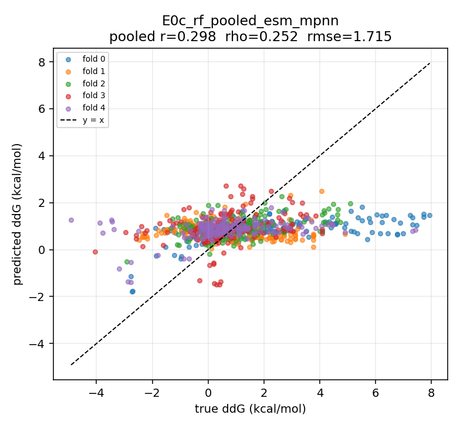
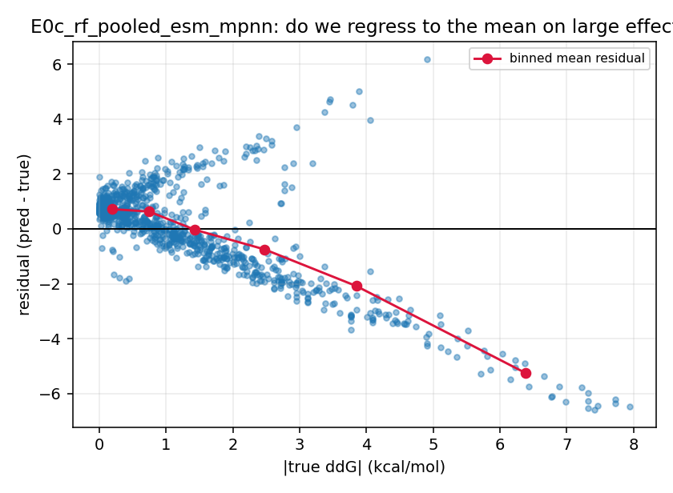
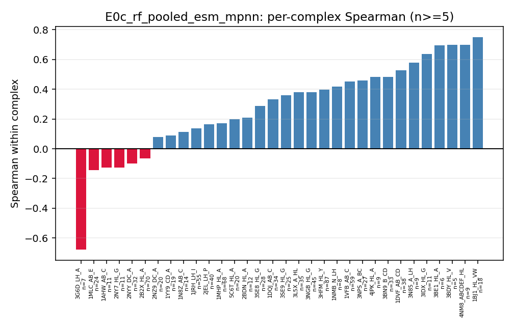

# Error analysis — E0c_rf_pooled_esm_mpnn (seed 0)

Out-of-fold predictions on the frozen 5-fold by-complex split
(`data/splits/skempi_abag_5fold_by_complex.json`).

Read every slice against its own `sd_true`: **`rmse_over_sd` >= 1 means the model adds
nothing within that slice**, whatever its RMSE looks like next to other slices. And
check `top_cx_share` before believing a slice — at 0.6 the slice result is one
complex's result wearing a category label.

## Overall

| n | complexes | pearson | spearman | rmse | mae | acc3 | f1_macro3 | per-complex rho |
|---|---|---|---|---|---|---|---|---|
| 940 | 53 | 0.298 | 0.252 | 1.715 | 1.252 | 0.404 | 0.268 | 0.363 |

## Regression to the mean

| |ddG| bin | n | n_cx | top_cx_share | sd_true | rmse | rmse_over_sd | mae | bias | micro_rho | macro_rho |
|---|---|---|---|---|---|---|---|---|---|---|
| <=0.5 | 315.0 | 39.0 | 0.1 | 0.244 | 0.873 | 3.578 | 0.786 | 0.717 | 0.038 | 0.085 |
| 0.5-1 | 178.0 | 37.0 | 0.1 | 0.716 | 1.002 | 1.399 | 0.748 | 0.632 | 0.037 | 0.038 |
| 1-2 | 210.0 | 36.0 | 0.11 | 1.104 | 1.111 | 1.006 | 0.864 | -0.033 | 0.1 | 0.051 |
| >2 | 237.0 | 39.0 | 0.21 | 2.544 | 2.967 | 1.166 | 2.594 | -1.818 | 0.311 | -0.134 |

A negative bias that grows with |ddG| is the signature of shrinking large effects
toward the mean.

## Per complex

32 of 53 complexes have n >= 5. The five worst:

| complex | n | spearman | rmse |
|---|---|---|---|
| 3G6D_LH_A | 7 | -0.679 | 1.357 |
| 1MLC_AB_E | 24 | -0.145 | 2.031 |
| 1AHW_AB_C | 11 | -0.127 | 1.245 |
| 2NY7_HL_G | 11 | -0.127 | 1.269 |
| 2NYY_DC_A | 32 | -0.1 | 1.588 |

The five best:

| complex | n | spearman | rmse |
|---|---|---|---|
| 1BJ1_HL_VW | 18 | 0.75 | 1.324 |
| 4NM8_ABCDEF_HL | 9 | 0.7 | 1.411 |
| 3BDY_HL_V | 5 | 0.7 | 1.026 |
| 3BE1_HL_A | 6 | 0.696 | 1.591 |
| 3IDX_HL_G | 11 | 0.636 | 2.458 |

## By mutation category

### to-alanine vs other

| to_alanine | n | n_cx | top_cx_share | sd_true | rmse | rmse_over_sd | mae | bias | micro_rho | macro_rho |
|---|---|---|---|---|---|---|---|---|---|---|
| False | 524.0 | 45.0 | 0.13 | 1.69 | 1.664 | 0.984 | 1.282 | 0.104 | 0.083 | 0.266 |
| True | 416.0 | 31.0 | 0.1 | 1.82 | 1.777 | 0.977 | 1.214 | -0.37 | 0.394 | 0.273 |

### charge change vs none

| charge_change | n | n_cx | top_cx_share | sd_true | rmse | rmse_over_sd | mae | bias | micro_rho | macro_rho |
|---|---|---|---|---|---|---|---|---|---|---|
| False | 489.0 | 47.0 | 0.09 | 1.539 | 1.454 | 0.945 | 1.044 | -0.016 | 0.355 | 0.256 |
| True | 451.0 | 42.0 | 0.14 | 2.03 | 1.959 | 0.965 | 1.477 | -0.202 | 0.177 | 0.181 |

### interface vs non-interface (SKEMPI COR/SUP/RIM)

| interface | n | n_cx | top_cx_share | sd_true | rmse | rmse_over_sd | mae | bias | micro_rho | macro_rho |
|---|---|---|---|---|---|---|---|---|---|---|
| False | 151.0 | 27.0 | 0.15 | 0.737 | 1.025 | 1.391 | 0.816 | 0.58 | 0.079 | 0.285 |
| True | 789.0 | 50.0 | 0.11 | 1.883 | 1.817 | 0.965 | 1.336 | -0.237 | 0.22 | 0.286 |

### single vs multi-point

| single_point | n | n_cx | top_cx_share | sd_true | rmse | rmse_over_sd | mae | bias | micro_rho | macro_rho |
|---|---|---|---|---|---|---|---|---|---|---|
| False | 272.0 | 29.0 | 0.25 | 2.299 | 2.15 | 0.935 | 1.729 | -0.18 | 0.298 | 0.209 |
| True | 668.0 | 46.0 | 0.11 | 1.538 | 1.502 | 0.977 | 1.058 | -0.075 | 0.273 | 0.302 |

## By chain

`ab_vs_ab` is 1DVF, the anti-idiotope antibody-antibody pair, where the
antibody/antigen labels are conventions rather than facts.

| mutated_side | n | n_cx | top_cx_share | sd_true | rmse | rmse_over_sd | mae | bias | micro_rho | macro_rho |
|---|---|---|---|---|---|---|---|---|---|---|
| ab_vs_ab | 38.0 | 1.0 | 1.0 | 1.314 | 1.811 | 1.378 | 1.469 | -1.368 | 0.527 | 0.527 |
| antibody | 539.0 | 35.0 | 0.13 | 1.521 | 1.474 | 0.969 | 1.14 | 0.151 | 0.123 | 0.284 |
| antigen | 320.0 | 26.0 | 0.13 | 1.754 | 1.749 | 0.997 | 1.226 | -0.083 | 0.216 | 0.158 |
| both | 43.0 | 3.0 | 0.37 | 2.232 | 3.376 | 1.513 | 2.661 | -2.375 | -0.238 | -0.061 |

## 3-class calibration (rule 5 bins on |ddG|)

| actual | pred_low | pred_medium | pred_high |
|---|---|---|---|
| true_low | 44 | 271 | 0 |
| true_medium | 51 | 330 | 7 |
| true_high | 20 | 211 | 6 |

## Attention sanity check

*Not applicable: requires E3 or later (distance-biased cross-attention). No
attention-based experiment has produced out-of-fold predictions yet.*
